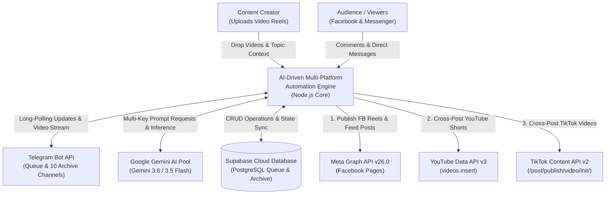
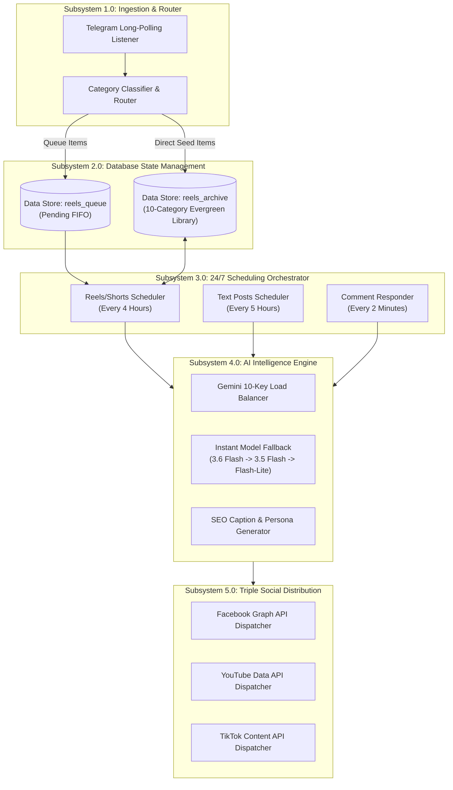
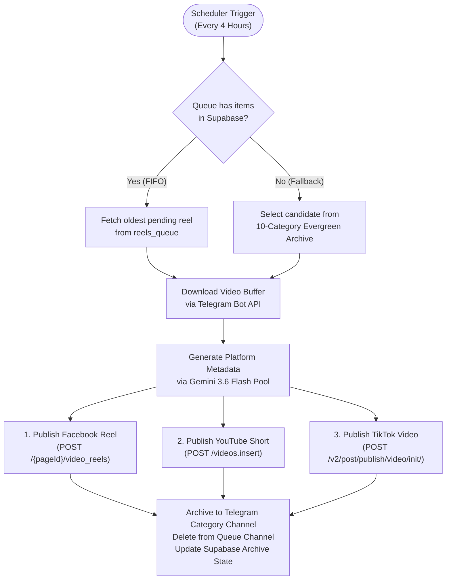
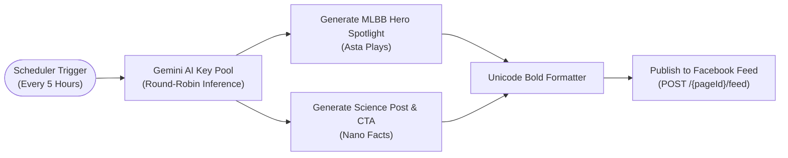
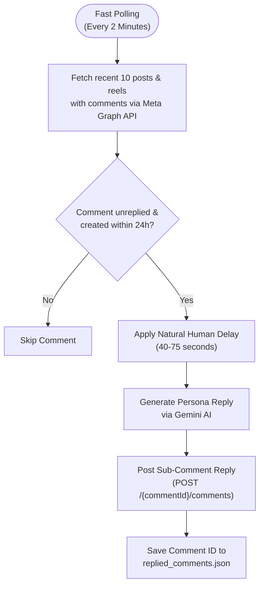
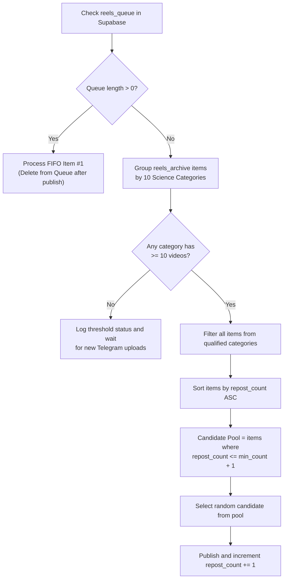
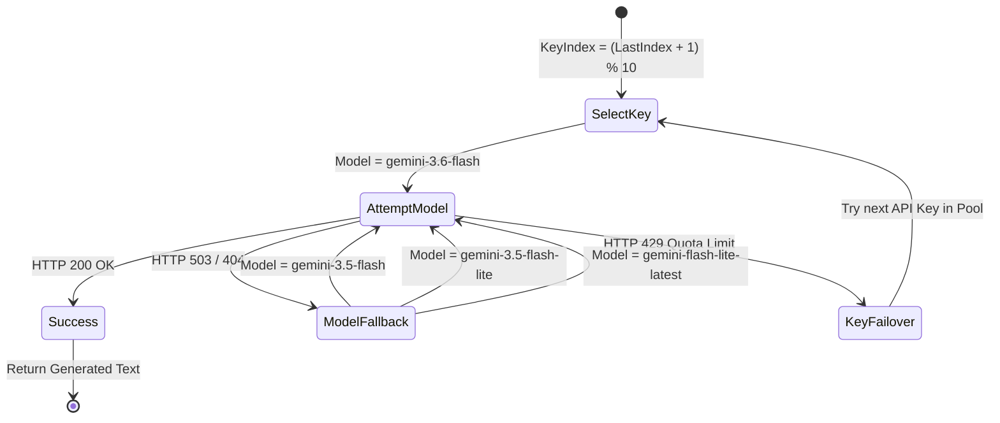
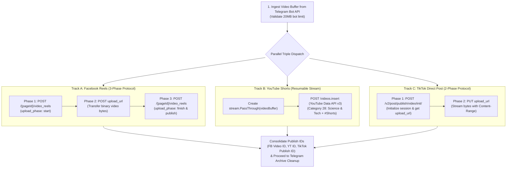

# Facebook, YouTube & TikTok AI-Driven Automation Engine

A production-grade multi-platform automation backend built with Node.js that powers 24/7 scheduled content creation, multi-channel Telegram video reels ingestion, **Facebook Reels, YouTube Shorts & TikTok Triple Cross-Posting**, intelligent comment auto-responding, and 10-category evergreen content recycling.

---

## Managed Social Channels & Pages

* **Nano Facts** - Science, Deep Space & Technology Page
  * Facebook Page: [facebook.com/nanoscie](https://www.facebook.com/nanoscie)
  * YouTube Channel: [youtube.com/@nielskysgamingtv1835](https://www.youtube.com/@nielskysgamingtv1835)
  * TikTok Account: [tiktok.com/@nanoscie](https://www.tiktok.com/@nanoscie)
  * Subscription Hub: [facebook.com/nanoscie/subscribe](https://www.facebook.com/nanoscie/subscribe/)
  * Portal & Legal: [nanofacts-automation.netlify.app](https://nanofacts-automation.netlify.app/)
* **Asta Plays** - Mobile Legends: Bang Bang (MLBB) Gaming Page
  * Facebook Page: [facebook.com/astaplasys05](https://www.facebook.com/astaplasys05)

---

## Core Systems & Architecture

The architecture is structured across four standardized Data Flow Diagram (DFD) levels, spanning from high-level system context to micro-level execution algorithms.

---

### Data Flow Diagram Level 0: System Context (Macro Architecture)

#### Functional Overview:
DFD Level 0 defines the macro-level operational boundary of the automation platform. The central **Automation Engine** operates as an autonomous processing core that interfaces with seven external entities:
1. **Content Creator:** Drops raw vertical video files and topic hints into Telegram.
2. **Audience & Followers:** Posts comments and sends private Messenger messages.
3. **Telegram Cloud API:** Delivers long-polling updates and raw MP4 video streams.
4. **Google Gemini AI Key Pool:** Provides multi-model LLM generation for SEO captions, hashtags, and contextual conversation replies.
5. **Supabase PostgreSQL Cloud:** Stores persistent FIFO queue states and 10-category evergreen archive metadata.
6. **Meta Graph API (v26.0):** Receives published Facebook Page feeds, Video Reels, and sub-comment replies.
7. **Google YouTube Data API (v3) & TikTok Content Posting API (v2):** Receives automated YouTube Shorts and TikTok video uploads.



---

### Data Flow Diagram Level 1: Subsystem Decomposition (High-Level Architecture)

#### Functional Overview:
DFD Level 1 decomposes the central engine into five interconnected primary subsystems and two centralized data stores:
* **Subsystem 1.0 (Telegram Ingestion & Router):** Captures incoming video messages across Telegram channels and categorizes them.
* **Subsystem 2.0 (Supabase State Management):** Manages persistent state for pending FIFO queue items and evergreen archived items.
* **Subsystem 3.0 (24/7 Scheduling Orchestrator):** Manages interval cron triggers using `node-schedule`.
* **Subsystem 4.0 (AI Intelligence Engine):** Balances API traffic across 10 Gemini keys with automatic failover and SEO formatting.
* **Subsystem 5.0 (Triple-Platform Social Distribution):** Executes parallel publishing to Facebook Reels, YouTube Shorts, and TikTok.



---

### Data Flow Diagram Level 2: Detailed Functional Process Workflows

#### Functional Overview:
DFD Level 2 details the execution flow of the three primary automated workflows running concurrently.

#### Workflow 2.1: Multi-Platform Video Publishing & Cross-Posting Workflow
1. **Trigger:** Fires every 4 hours (12 AM, 4 AM, 8 AM, 12 PM, 4 PM, 8 PM) or upon boot.
2. **Fetch:** Checks Supabase `reels_queue` for pending FIFO video. If empty, selects eligible video from `reels_archive`.
3. **Binary Transfer:** Downloads binary video buffer from Telegram API.
4. **AI Generation:** Generates Facebook caption with subscription CTA and YouTube Shorts SEO metadata.
5. **Triple Dispatch:** Publishes concurrently to Facebook Reels, YouTube Shorts, and TikTok.
6. **Archive & Cleanup:** Copies video to Telegram category archive channel, deletes from Queue channel, and updates Supabase database.



#### Workflow 2.2: Automated Feed Text Content Workflow
1. **Trigger:** Fires every 5 hours (1 AM, 6 AM, 11 AM, 4 PM, 9 PM).
2. **Generation:** Generates Mobile Legends spotlight post for Asta Plays and Science & Technology post for Nano Facts.
3. **Formatting:** Converts headlines to Unicode bold text.
4. **Publication:** Posts directly to Facebook page feeds via `POST /{pageId}/feed`.



#### Workflow 2.3: Interactive Audience Engagement & Comment Auto-Responder
1. **Trigger:** Fast-polling interval every 2 minutes.
2. **Scan:** Queries recent Facebook posts and video reels for unreplied comments.
3. **Deduplication:** Checks local cache `replied_comments.json` to prevent duplicate replies.
4. **Natural Pacing:** Applies randomized human-like delay (40 to 75 seconds).
5. **AI Persona:** Generates contextual single-paragraph reply without emojis.
6. **Reply:** Posts sub-comment reply via `POST /{commentId}/comments`.



---

### Data Flow Diagram Level 3: Micro-Level Logic & Algorithmic State Machines

#### Functional Overview:
DFD Level 3 exposes the low-level algorithmic logic and state machines governing core operational resilience.

#### Logic 3.1: Supabase Evergreen Archive Recycling Algorithm
* **Minimum Threshold:** At least 10 videos must exist per category before recycling is allowed, preventing repetitive content.
* **Fair Rotation:** Eligible categories sort items by `repost_count ASC`, prioritizing the least-frequently posted items.
* **Update:** Increments `repost_count += 1` and updates `last_reposted_at` timestamp upon successful publication.



#### Logic 3.2: Gemini 10-Key Pool Round-Robin & Fast-Failover State Machine
* **Round-Robin Index:** Sequential rotation across 10 Gemini API keys (`GEMINI_PROJECT_1` through `10`).
* **503 Spike Fast-Failover:** Automatically drops through model hierarchy (`gemini-3.6-flash` -> `gemini-3.5-flash` -> `gemini-3.5-flash-lite` -> `gemini-flash-lite-latest`) without crashing the job.
* **429 Quota Recovery:** Switches to the next available API key in the pool on quota exhaustion.



#### Logic 3.3: 3-Way Video Binary Chunk Upload Lifecycle

* **Telegram Stream Ingestion:** Downloads raw MP4 video buffer directly via `GET /file/bot{token}/{file_path}` while validating Telegram's 20MB bot limit.
* **Track A - Facebook Reels (3-Phase Protocol):** 
  1. `POST /{pageId}/video_reels` with `upload_phase: "start"` to generate `upload_url` and `video_id`.
  2. `POST {upload_url}` to stream binary video bytes.
  3. `POST /{pageId}/video_reels` with `upload_phase: "finish"` and caption to publish.
* **Track B - YouTube Shorts (Resumable Stream Protocol):** 
  1. Wraps binary buffer in `stream.PassThrough()`.
  2. Executes `youtube.videos.insert` with category 28 (Science & Technology), privacy "public", and `#Shorts` tag.
* **Track C - TikTok Direct Post (2-Phase Protocol):** 
  1. `POST /v2/post/publish/video/init/` with `source: "FILE_UPLOAD"` to obtain `upload_url` and `publish_id`.
  2. `PUT {upload_url}` with `Content-Range: bytes 0-{size-1}/{size}` header to transfer chunks.



---

## Supabase Database Setup

Run this SQL script in your **Supabase Dashboard > SQL Editor**:

```sql
-- 1. Table for Pending Telegram Queue (FIFO)
CREATE TABLE IF NOT EXISTS reels_queue (
    id BIGSERIAL PRIMARY KEY,
    message_id BIGINT UNIQUE NOT NULL,
    file_id TEXT NOT NULL,
    caption TEXT DEFAULT '',
    file_size BIGINT,
    duration INT,
    created_at TIMESTAMPTZ DEFAULT NOW()
);

-- 2. Table for Permanent Archive / 10-Category Evergreen Library
CREATE TABLE IF NOT EXISTS reels_archive (
    id BIGSERIAL PRIMARY KEY,
    file_id TEXT UNIQUE NOT NULL,
    category TEXT NOT NULL DEFAULT 'General',
    caption TEXT DEFAULT '',
    original_posted_at TIMESTAMPTZ DEFAULT NOW(),
    last_reposted_at TIMESTAMPTZ,
    repost_count INT DEFAULT 0,
    fb_video_id TEXT
);

-- Indexes for fast query lookup
CREATE INDEX IF NOT EXISTS idx_reels_archive_category ON reels_archive(category);
CREATE INDEX IF NOT EXISTS idx_reels_archive_repost ON reels_archive(repost_count ASC);
```

---

## 10-Category Telegram Archive Structure

| # | Category Name | Description | Telegram Channel Env Key |
| :---: | :--- | :--- | :--- |
| **1** | **Human Biology & Anatomy** | Cellular biology, genetics, immunology, neuroscience | `TG_CHANNEL_BIOLOGY_ID` |
| **2** | **Chemistry & Periodic Table** | Breakthrough molecules, chemical reactions, elements | `TG_CHANNEL_CHEMISTRY_ID` |
| **3** | **Astronomy & Deep Space** | Astrophysics, exoplanets, galaxies, black holes | `TG_CHANNEL_ASTRONOMY_ID` |
| **4** | **Quantum & Modern Physics** | Particle physics, optics, laser tech, quantum mechanics | `TG_CHANNEL_PHYSICS_ID` |
| **5** | **AI, Robotics & Future Technology** | Neural networks, humanoid robotics, quantum computing | `TG_CHANNEL_ROBOTICS_ID` |
| **6** | **Deep Sea & Ocean Mysteries** | Mariana trench, abyssal organisms, marine biology | `TG_CHANNEL_OCEAN_ID` |
| **7** | **Earth Sciences & Extreme Nature** | Volcanology, atmospheric science, geology | `TG_CHANNEL_EARTH_ID` |
| **8** | **Materials Science & Nanotechnology** | Graphene, superconductors, aerogels, metamaterials | `TG_CHANNEL_MATERIALS_ID` |
| **9** | **Paleontology & Prehistoric Life** | Fossils, dinosaurs, evolutionary biology, prehistoric life | `TG_CHANNEL_PALEONTOLOGY_ID` |
| **10** | **Rocket Science & Space Missions** | SpaceX, NASA propulsion, orbital mechanics, rovers | `TG_CHANNEL_ROCKETS_ID` |

---

## 24-Hour Schedule Matrix

| Time | Facebook Reels + YouTube Shorts + TikTok | Nano Facts (Science Post) | Asta Plays (MLBB Post) |
| :---: | :---: | :---: | :---: |
| **12:00 AM** | Cross-Post 3 Platforms | - | - |
| **1:00 AM** | - | Publish Post | Publish Post |
| **4:00 AM** | Cross-Post 3 Platforms | - | - |
| **6:00 AM** | - | Publish Post | Publish Post |
| **8:00 AM** | Cross-Post 3 Platforms | - | - |
| **11:00 AM** | - | Publish Post | Publish Post |
| **12:00 PM** | Cross-Post 3 Platforms | - | - |
| **4:00 PM** | Cross-Post 3 Platforms | Publish Post | Publish Post |
| **8:00 PM** | Cross-Post 3 Platforms | - | - |
| **9:00 PM** | - | Publish Post | Publish Post |

---

## Environment Variables Reference

| Variable | Description |
| :--- | :--- |
| `GEMINI_PROJECT_1` .. `_10` | Google Gemini API Keys Pool (Round-Robin & Auto-Failover) |
| `FB_PAGE_ID_ASTA_PLAYS` | Facebook Page ID for Asta Plays |
| `FB_PAGE_ACCESS_TOKEN_ASTA_PLAYS` | Permanent Page Access Token for Asta Plays |
| `FB_PAGE_ID_NANO_FACTS` | Facebook Page ID for Nano Facts |
| `FB_PAGE_ACCESS_TOKEN_NANO_FACTS` | Permanent Page Access Token for Nano Facts |
| `YOUTUBE_CLIENT_ID` | Google Cloud OAuth2 Client ID |
| `YOUTUBE_CLIENT_SECRET` | Google Cloud OAuth2 Client Secret |
| `YOUTUBE_REFRESH_TOKEN` | Google OAuth2 Refresh Token for YouTube |
| `TIKTOK_CLIENT_KEY` | TikTok Content Posting API Client Key |
| `TIKTOK_CLIENT_SECRET` | TikTok Content Posting API Client Secret |
| `TIKTOK_REFRESH_TOKEN` | TikTok OAuth2 Refresh Token (1 Year Expiry) |
| `TIKTOK_OPEN_ID` | TikTok Open ID for `@nanoscie` |
| `TELEGRAM_BOT_TOKEN` | Bot API Token from `@BotFather` |
| `TELEGRAM_CHANNEL_QUEUE_ID` | Telegram Channel 1 ID (`FB Reels to Post`) |
| `TG_CHANNEL_BIOLOGY_ID` ... `_ROCKETS_ID` | 10 Telegram Category Archive Channels |
| `SUPABASE_URL` | Supabase Project URL (`https://xyz.supabase.co`) |
| `SUPABASE_KEY` | Supabase Service Role Key |
| `PORT` | Webhook HTTP Server Port (Default: `3000` / `8080`) |
| `FB_VERIFY_TOKEN` | Webhook Secret Verification Token |

---

## Deployment & Local Execution

### Local Run
```bash
# 1. Install dependencies
npm install

# 2. Start the automation engine
npm start
```

---

## License
This project is licensed under the [MIT License](LICENSE).
