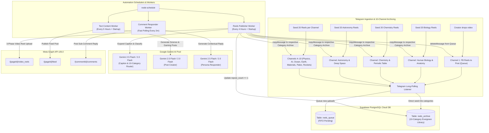

# Facebook & Telegram AI-Driven Automation Engine

A production-grade backend automation engine built with Node.js that powers 24/7 scheduled content creation, multi-channel Telegram video reels publishing with **Supabase Database Persistence**, intelligent comment auto-responding, and 10-category evergreen content recycling across multiple Facebook Pages.

---

## 🌟 Managed Facebook Pages & Hubs

* **Nano Facts** — Science, Deep Space & Technology Page
  * Facebook Page: [facebook.com/nanoscie](https://www.facebook.com/nanoscie)
  * Subscription Hub: [facebook.com/nanoscie/subscribe](https://www.facebook.com/nanoscie/subscribe/)
* **Asta Plays** — Mobile Legends: Bang Bang (MLBB) Gaming Page
  * Facebook Page: [facebook.com/astaplasys05](https://www.facebook.com/astaplasys05)

---

## 🚀 Core Systems & Architecture



---

## 🗄️ Supabase Database Setup

Run this SQL script in your **Supabase Dashboard > SQL Editor** to create the tables:

```sql
-- 1. Table para sa Pending Telegram Queue (FIFO)
CREATE TABLE IF NOT EXISTS reels_queue (
    id BIGSERIAL PRIMARY KEY,
    message_id BIGINT UNIQUE NOT NULL,
    file_id TEXT NOT NULL,
    caption TEXT DEFAULT '',
    file_size BIGINT,
    duration INT,
    created_at TIMESTAMPTZ DEFAULT NOW()
);

-- 2. Table para sa Permanent Archive / 10-Category Evergreen Library
CREATE TABLE IF NOT EXISTS reels_archive (
    id BIGSERIAL PRIMARY KEY,
    file_id TEXT UNIQUE NOT NULL,
    category TEXT NOT NULL DEFAULT 'General',
    caption TEXT DEFAULT '',
    original_posted_at TIMESTAMPTZ DEFAULT NOW(),
    last_reposted_at TIMESTAMPTZ,
    repost_count INT DEFAULT 0,
    fb_video_id TEXT
);

-- Indexes para mabilis ang category at least-reposted query
CREATE INDEX IF NOT EXISTS idx_reels_archive_category ON reels_archive(category);
CREATE INDEX IF NOT EXISTS idx_reels_archive_repost ON reels_archive(repost_count ASC);
```

---

## 🌟 10-Category Telegram Archive Structure

| # | Category Name | Emoji | Telegram Channel Env Key |
| :---: | :--- | :---: | :--- |
| **1** | **Human Biology & Anatomy** | 🧬 | `TG_CHANNEL_BIOLOGY_ID` |
| **2** | **Chemistry & Periodic Table** | ⚛️ | `TG_CHANNEL_CHEMISTRY_ID` |
| **3** | **Astronomy & Deep Space** | 🌌 | `TG_CHANNEL_ASTRONOMY_ID` |
| **4** | **Quantum & Modern Physics** | ⚡ | `TG_CHANNEL_PHYSICS_ID` |
| **5** | **AI, Robotics & Future Technology** | 🤖 | `TG_CHANNEL_ROBOTICS_ID` |
| **6** | **Deep Sea & Ocean Mysteries** | 🌊 | `TG_CHANNEL_OCEAN_ID` |
| **7** | **Earth Sciences & Extreme Nature** | 🌋 | `TG_CHANNEL_EARTH_ID` |
| **8** | **Materials Science & Nanotechnology** | 🔬 | `TG_CHANNEL_MATERIALS_ID` |
| **9** | **Paleontology & Prehistoric Life** | 🦖 | `TG_CHANNEL_PALEONTOLOGY_ID` |
| **10** | **Rocket Science & Space Missions** | 🚀 | `TG_CHANNEL_ROCKETS_ID` |

---

## ⏰ 24-Hour Schedule Matrix

| Time | Facebook Reels (`NanoFactsPublisherBot`) | Nano Facts (Science Post) | Asta Plays (MLBB Post) |
| :---: | :---: | :---: | :---: |
| **12:00 AM** | 🎬 Publish / Recycle Reel | — | — |
| **1:00 AM** | — | 🔬 Publish Post | 🎮 Publish Post |
| **4:00 AM** | 🎬 Publish / Recycle Reel | — | — |
| **6:00 AM** | — | 🔬 Publish Post | 🎮 Publish Post |
| **8:00 AM** | 🎬 Publish / Recycle Reel | — | — |
| **11:00 AM** | — | 🔬 Publish Post | 🎮 Publish Post |
| **12:00 PM** | 🎬 Publish / Recycle Reel | — | — |
| **4:00 PM** | 🎬 Publish / Recycle Reel | 🔬 Publish Post | 🎮 Publish Post |
| **8:00 PM** | 🎬 Publish / Recycle Reel | — | — |
| **9:00 PM** | — | 🔬 Publish Post | 🎮 Publish Post |

*Note: The **AI Comment Responder** runs continuously via Fast Polling every 2 minutes (`*/2 * * * *`) with a natural human typing delay (40–75s) to respond to new comments near instantly and safely.*

---

## 🔑 Environment Variables Reference

| Variable | Description |
| :--- | :--- |
| `GEMINI_PROJECT_1` .. `_10` | Google Gemini API Keys Pool (Round-Robin & Auto-Failover) |
| `FB_PAGE_ID_ASTA_PLAYS` | Facebook Page ID for Asta Plays |
| `FB_PAGE_ACCESS_TOKEN_ASTA_PLAYS` | Permanent Page Access Token for Asta Plays |
| `FB_PAGE_ID_NANO_FACTS` | Facebook Page ID for Nano Facts |
| `FB_PAGE_ACCESS_TOKEN_NANO_FACTS` | Permanent Page Access Token for Nano Facts |
| `TELEGRAM_BOT_TOKEN` | Bot API Token from `@BotFather` |
| `TELEGRAM_CHANNEL_QUEUE_ID` | Telegram Channel 1 ID (`FB Reels to Post`) |
| `TG_CHANNEL_BIOLOGY_ID` | Channel ID for Human Biology & Anatomy |
| `TG_CHANNEL_CHEMISTRY_ID` | Channel ID for Chemistry & Periodic Table |
| `TG_CHANNEL_ASTRONOMY_ID` | Channel ID for Astronomy & Deep Space |
| `TG_CHANNEL_PHYSICS_ID` | Channel ID for Quantum & Modern Physics |
| `TG_CHANNEL_ROBOTICS_ID` | Channel ID for AI, Robotics & Future Technology |
| `TG_CHANNEL_OCEAN_ID` | Channel ID for Deep Sea & Ocean Mysteries |
| `TG_CHANNEL_EARTH_ID` | Channel ID for Earth Sciences & Extreme Nature |
| `TG_CHANNEL_MATERIALS_ID` | Channel ID for Materials Science & Nanotechnology |
| `TG_CHANNEL_PALEONTOLOGY_ID` | Channel ID for Paleontology & Prehistoric Life |
| `TG_CHANNEL_ROCKETS_ID` | Channel ID for Rocket Science & Space Missions |
| `SUPABASE_URL` | Supabase Project URL (`https://xyz.supabase.co`) |
| `SUPABASE_KEY` | Supabase Service Role Key |
| `PORT` | Webhook HTTP Server Port (Default: `3000` / `8080`) |
| `FB_VERIFY_TOKEN` | Webhook Secret Verification Token |

---

## 🚀 Deployment & Local Execution

### Local Run
```bash
# 1. Install dependencies
npm install

# 2. Start the automation engine
npm start
```

---

## 📄 License
This project is licensed under the [MIT License](LICENSE).
