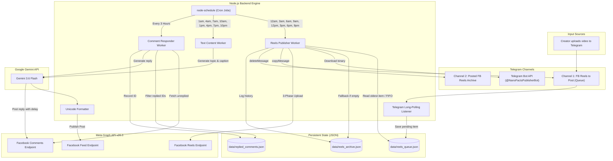
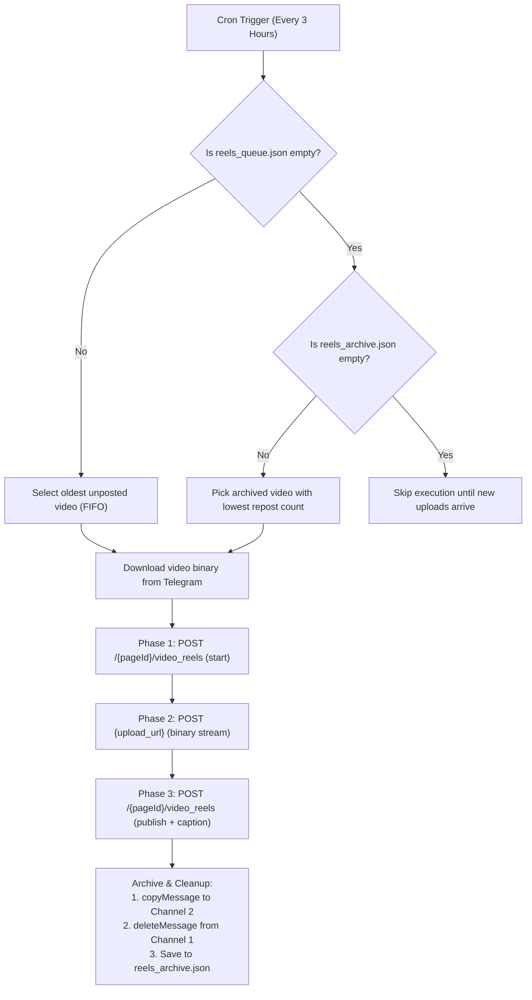

# Facebook & Telegram Automated Publishing Pipeline

A backend automation service built with Node.js that manages scheduled content publishing and audience engagement across multiple Facebook Pages and Telegram channels.

---

## Live Pages Managed by this System

* **Nano Facts** — Science & Technology Page
  * Facebook: [facebook.com/nanoscie](https://www.facebook.com/nanoscie)
  * Subscription Hub: [facebook.com/nanoscie/subscribe](https://www.facebook.com/nanoscie/subscribe/)
* **Asta Plays** — Gaming & MLBB Content
  * Facebook: [facebook.com/astaplasys05](https://www.facebook.com/astaplasys05)

---

## Overview

This system handles three main workflows:

1. **Telegram-to-Facebook Reels Publishing:** Ingests 30-second video clips from a staging Telegram channel (`FB Reels to Post`), uploads them to Facebook using the 3-step Reels Publishing API, moves published clips to an archive channel (`Posted FB Reels Archive`), and falls back to recycling archived clips whenever the queue is empty.
2. **AI Text Generation:** Generates niche-specific posts for Science/Tech and Gaming using Google Gemini (3.6 Flash), formats titles and subheadings with custom Unicode bold characters, and appends SEO keywords and hashtags.
3. **Automated Comment Responses:** Periodically queries unreplied Facebook comments, generates contextual replies matching the page persona, and replies back with randomized human-paced delays (45–90s) to maintain natural engagement pacing.

---

## System Architecture



---

## Publishing Workflow & Logic

### 1. Facebook Reels Pipeline (FIFO + Fallback)



* **Staging Channel:** Videos uploaded to Channel 1 are automatically parsed and saved to `data/reels_queue.json`.
* **FIFO Processing:** When the cron trigger runs, the earliest uploaded video in the queue is processed first.
* **3-Phase Handshake:** Uses Meta's chunked video reels upload endpoints (`start` $\rightarrow$ `binary data transfer` $\rightarrow$ `finish/publish`).
* **Archive & Cleanup:** On successful upload, the bot calls `copyMessage` to copy the reel to Channel 2, `deleteMessage` to remove it from Channel 1, and saves the file record to `data/reels_archive.json`.
* **Archive Fallback:** If Channel 1 has no pending videos, the system selects an archived video prioritizing lowest `repostCount` to keep posting without repetition.

---

### 2. AI Content Generator

* **Nano Facts (Science & Tech):** Generates posts across diverse domains (Astronomy, Quantum Physics, Genetics, Materials Science, AI, Oceanography, and Chemistry) with an embedded Subscription CTA directing readers to the [Nano Facts Science Library](https://www.facebook.com/nanoscie/subscribe/).
* **Asta Plays (MLBB Gaming):** Generates Mobile Legends hero breakdowns, combo tips, and gameplay advice with gamer-focused SEO keywords.
* **Unicode Bold Formatter:** Converts `TITLE:` lines, `**bold text**`, and key section headers into Unicode bold characters (`𝗔-𝗭`, `𝗮-𝘇`, `𝟬-𝟵`) so text renders with clear visual hierarchy directly on Facebook feed.

---

### 3. Comment Auto-Responder

* Checks the 10 most recent page posts and video reels for new comments every 3 hours.
* Runs concurrently across managed pages using `Promise.allSettled`.
* Filters out comments older than 24 hours and comments already answered by the page.
* Generates contextual, friendly responses using Gemini matching the page persona.
* Introduces a randomized delay (45–90 seconds) between replies to maintain natural interaction pacing.
* Saves processed comment IDs to `data/replied_comments.json` to prevent duplicate responses.

---

### 4. Facebook Messenger AI Chat Auto-Responder (Real-Time Webhooks)

* Listens for real-time private messages via Express Webhook endpoints (`GET /webhook` & `POST /webhook`).
* Automatically matches incoming recipient Page IDs (`Asta Plays` or `Nano Facts`).
* Displays a natural **typing indicator** (`typing_on`) while Gemini processes the response.
* Replies directly via the **Messenger Send API** (`POST /me/messages`) with niche-specific AI personas.
* Implements in-memory message deduplication to avoid double-replies from Meta webhook retries.

---

## 24-Hour Schedule Matrix

The posting timetable is structured so Reels and Text Posts alternate every hour:

| Time | Facebook Reels (`NanoFactsPublisherBot`) | Nano Facts (Science Post) | Asta Plays (MLBB Post) |
| :---: | :---: | :---: | :---: |
| **12:00 AM** | Publish Reel | — | — |
| **1:00 AM** | — | Publish Post | Publish Post |
| **3:00 AM** | Publish Reel | — | — |
| **4:00 AM** | — | Publish Post | Publish Post |
| **6:00 AM** | Publish Reel | — | — |
| **7:00 AM** | — | Publish Post | Publish Post |
| **9:00 AM** | Publish Reel | — | — |
| **10:00 AM** | — | Publish Post | Publish Post |
| **12:00 PM** | Publish Reel | — | — |
| **1:00 PM** | — | Publish Post | Publish Post |
| **3:00 PM** | Publish Reel | — | — |
| **4:00 PM** | — | Publish Post | Publish Post |
| **6:00 PM** | Publish Reel | — | — |
| **7:00 PM** | — | Publish Post | Publish Post |
| **9:00 PM** | Publish Reel | — | — |
| **10:00 PM** | — | Publish Post | Publish Post |

*Note: The AI Comment Responder runs in parallel every 3 hours (`0 */3 * * *`), and the Messenger Webhook listener runs continuously in the background.*

---

## Project Structure

```text
├── data/
│   ├── reels_queue.json          # Pending Telegram video queue
│   ├── reels_archive.json        # Historical posted videos and repost counts
│   └── replied_comments.json     # Record of processed comment IDs
├── src/
│   ├── config/
│   │   └── env.js                # Environment configuration loader
│   ├── jobs/
│   │   ├── astaPlays.job.js      # Asta Plays content workflow
│   │   ├── commentResponder.job.js # Comment responder workflow
│   │   ├── nanoFacts.job.js      # Nano Facts content workflow
│   │   └── reelsPublisher.job.js # Telegram Reels queue worker
│   ├── services/
│   │   ├── ai.service.js         # Google Gemini text & chat generation
│   │   ├── facebook.service.js   # Meta Graph API feed & video integration
│   │   ├── messenger.service.js  # Messenger Send API & typing indicators
│   │   └── telegram.service.js   # Telegram Bot listener, downloader & archiver
│   ├── utils/
│   │   ├── formatters.js         # Unicode bold text converter
│   │   └── storage.js            # JSON storage helper functions
│   ├── server.js                 # Express Webhook server for Messenger
│   └── index.js                  # Main scheduler and service bootstrapper
├── .env.example                  # Environment variables template
├── package.json                  # Dependencies and scripts
└── README.md                     # Documentation
```

---

## Environment Variables

Copy `.env.example` to `.env`:

```bash
cp .env.example .env
```

Configure the following variables:

```env
# Google Gemini API Keys
OPENAI_API_KEY_ASTA_PLAYS=your_gemini_api_key_asta_plays
OPENAI_API_KEY_NANO_FACTS=your_gemini_api_key_nano_facts

# Facebook Page Credentials (Asta Plays)
FB_PAGE_ID_ASTA_PLAYS=your_facebook_page_id_asta_plays
FB_PAGE_ACCESS_TOKEN_ASTA_PLAYS=your_page_access_token_asta_plays

# Facebook Page Credentials (Nano Facts)
FB_PAGE_ID_NANO_FACTS=your_facebook_page_id_nano_facts
FB_PAGE_ACCESS_TOKEN_NANO_FACTS=your_page_access_token_nano_facts

# Telegram Bot Configuration
TELEGRAM_BOT_TOKEN=your_telegram_bot_token
TELEGRAM_CHANNEL_QUEUE_ID=-100xxxxxxxxxx
TELEGRAM_CHANNEL_ARCHIVE_ID=-100yyyyyyyyyy
```

---

## Setup & Running

### Requirements
* Node.js v18.0.0 or higher
* npm v9.0.0 or higher

### Installation

```bash
# Clone the repository
git clone https://github.com/your-username/ai-driven-post-creator.git
cd ai-driven-post-creator

# Install dependencies
npm install

# Run the automation service
npm start
```

---

## Meta API Permissions Required

To run this automation without issues, ensure your Facebook Page Access Token includes the following permissions:

* `pages_show_list` — Detects and connects to managed pages.
* `pages_read_engagement` — Reads page posts, comments, and engagement data.
* `pages_manage_posts` — Publishes feed posts, photos, and video reels.
* `pages_manage_engagement` — Posts AI-generated comment replies.

---

## License

This project is licensed under the [MIT License](LICENSE).
