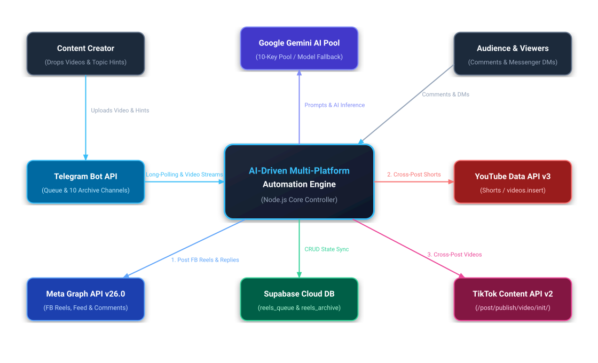
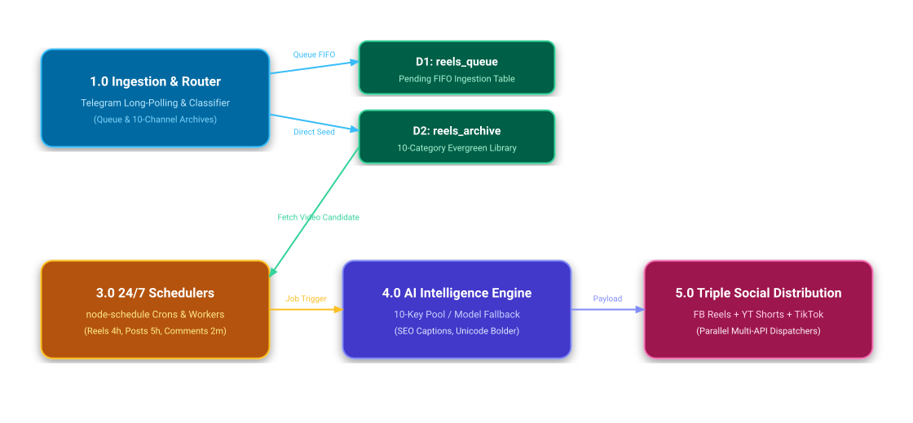
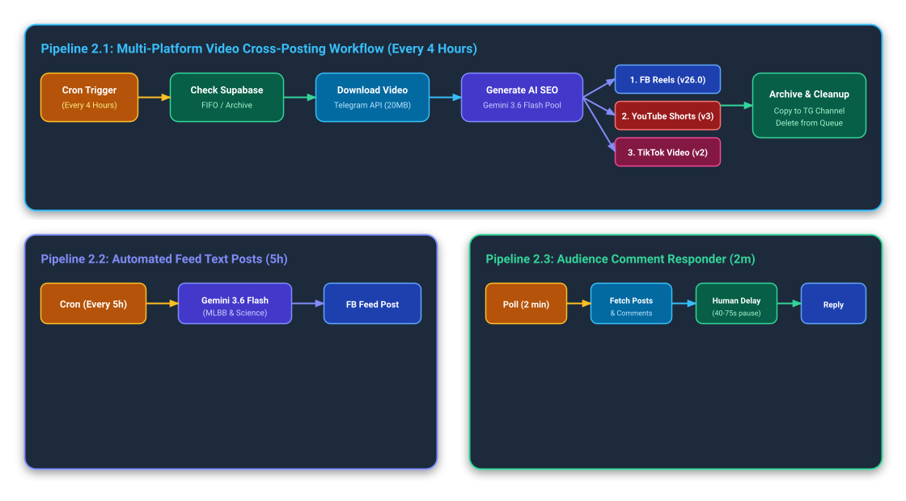
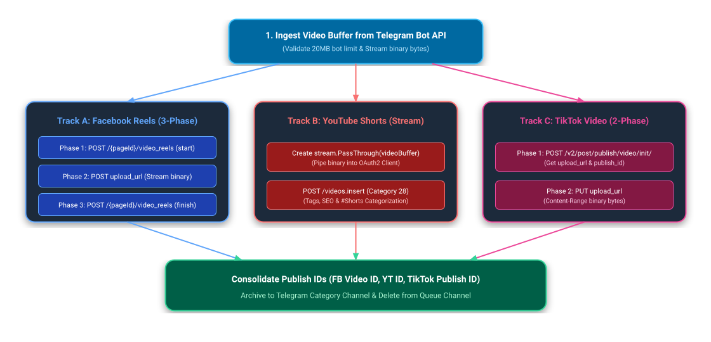

# Facebook, YouTube & TikTok AI-Driven Automation Engine

A production-grade multi-platform automation backend built with Node.js that powers 24/7 scheduled content creation, multi-channel Telegram video reels ingestion, **Facebook Reels, YouTube Shorts & TikTok Triple Cross-Posting**, intelligent comment auto-responding, and 10-category evergreen content recycling.

---

## Managed Social Channels & Pages

* **Nano Facts** - Science, Deep Space & Technology Page
  * Facebook Page: [facebook.com/nanoscie](https://www.facebook.com/nanoscie)
  * YouTube Channel: [youtube.com/@nielskysgamingtv1835](https://www.youtube.com/@nielskysgamingtv1835)
  * TikTok Account: [tiktok.com/@nanoscie](https://www.tiktok.com/@nanoscie)
  * Subscription Hub: [facebook.com/nanoscie/subscribe](https://www.facebook.com/nanoscie/subscribe/)
  * Portal & Legal: [nanofacts-automation.netlify.app](https://nanofacts-automation.netlify.app/)
* **Asta Plays** - Mobile Legends: Bang Bang (MLBB) Gaming Page
  * Facebook Page: [facebook.com/astaplasys05](https://www.facebook.com/astaplasys05)

---

## Core Systems & Architecture

The architecture is structured across four standardized Data Flow Diagram (DFD) levels, spanning from high-level system context to micro-level execution algorithms. Editable Draw.io diagrams are stored in [`docs/diagrams/`](docs/diagrams/) and rendered below.

---

### Data Flow Diagram Level 0: System Context (Macro Architecture)

#### Functional Overview:
DFD Level 0 defines the macro-level operational boundary of the automation platform. The central **Automation Engine** operates as an autonomous processing core that interfaces with seven external entities:
1. **Content Creator:** Drops raw vertical video files and topic hints into Telegram.
2. **Audience & Followers:** Posts comments and sends private Messenger messages.
3. **Telegram Cloud API:** Delivers long-polling updates and raw MP4 video streams.
4. **Google Gemini AI Key Pool:** Provides multi-model LLM generation for SEO captions, hashtags, and contextual conversation replies.
5. **Supabase PostgreSQL Cloud:** Stores persistent FIFO queue states and 10-category evergreen archive metadata.
6. **Meta Graph API (v26.0):** Receives published Facebook Page feeds, Video Reels, and sub-comment replies.
7. **Google YouTube Data API (v3) & TikTok Content Posting API (v2):** Receives automated YouTube Shorts and TikTok video uploads.

[](docs/diagrams/dfd_level_0.drawio)
*Open or import [`docs/diagrams/dfd_level_0.drawio`](docs/diagrams/dfd_level_0.drawio) in [draw.io](https://app.diagrams.net/) to edit.*

---

### Data Flow Diagram Level 1: Subsystem Decomposition (High-Level Architecture)

#### Functional Overview:
DFD Level 1 decomposes the central engine into five interconnected primary subsystems and two centralized data stores:
* **Subsystem 1.0 (Telegram Ingestion & Router):** Captures incoming video messages across Telegram channels and categorizes them.
* **Subsystem 2.0 (Supabase State Management):** Manages persistent state for pending FIFO queue items and evergreen archived items.
* **Subsystem 3.0 (24/7 Scheduling Orchestrator):** Manages interval cron triggers using `node-schedule`.
* **Subsystem 4.0 (AI Intelligence Engine):** Balances API traffic across 10 Gemini keys with automatic failover and SEO formatting.
* **Subsystem 5.0 (Triple-Platform Social Distribution):** Executes parallel publishing to Facebook Reels, YouTube Shorts, and TikTok.

[](docs/diagrams/dfd_level_1.drawio)
*Open or import [`docs/diagrams/dfd_level_1.drawio`](docs/diagrams/dfd_level_1.drawio) in [draw.io](https://app.diagrams.net/) to edit.*

---

### Data Flow Diagram Level 2: Detailed Functional Process Workflows

#### Functional Overview:
DFD Level 2 details the execution flow of the three primary automated workflows running concurrently:
* **Workflow 2.1 (Multi-Platform Video Publishing):** Periodic 4-hour cycle ingesting FIFO/Evergreen video, generating Gemini 3.6 SEO metadata, cross-posting concurrently to Facebook Reels, YouTube Shorts, and TikTok, followed by Telegram category archiving.
* **Workflow 2.2 (Automated Feed Text Posts):** 5-hour scheduled cycle generating specialized Gaming (MLBB) and Science content with Unicode formatting for Facebook Page Feeds.
* **Workflow 2.3 (Audience Comment Auto-Responder):** 2-minute fast-polling listener filtering unreplied comments within 24h, applying randomized human delay (40-75s), and replying contextually.

[](docs/diagrams/dfd_level_2.drawio)
*Open or import [`docs/diagrams/dfd_level_2.drawio`](docs/diagrams/dfd_level_2.drawio) in [draw.io](https://app.diagrams.net/) to edit.*

---

### Data Flow Diagram Level 3: Micro-Level Logic & Algorithmic State Machines

#### Functional Overview:
DFD Level 3 exposes the low-level algorithmic logic and state machines governing core operational resilience:
* **Logic 3.1 (Supabase Evergreen Recycling):** Minimum 10-video per-category thresholding, `repost_count ASC` sorting, and candidate selection.
* **Logic 3.2 (Gemini Multi-Key Failover):** 10-key round-robin rotation, 503 model fallback (`3.6 Flash` -> `3.5 Flash` -> `Flash-Lite`), and 429 quota switching.
* **Logic 3.3 (3-Way Video Binary Chunk Upload):** Direct binary stream ingestion via Telegram Bot API (20MB limit) followed by parallel dispatch across Facebook Reels (3-phase protocol), YouTube Shorts (stream PassThrough), and TikTok (2-phase chunk PUT).

[](docs/diagrams/dfd_level_3.drawio)
*Open or import [`docs/diagrams/dfd_level_3.drawio`](docs/diagrams/dfd_level_3.drawio) in [draw.io](https://app.diagrams.net/) to edit.*

---

## Supabase Database Setup

Run this SQL script in your **Supabase Dashboard > SQL Editor**:

```sql
-- 1. Table for Pending Telegram Queue (FIFO)
CREATE TABLE IF NOT EXISTS reels_queue (
    id BIGSERIAL PRIMARY KEY,
    message_id BIGINT UNIQUE NOT NULL,
    file_id TEXT NOT NULL,
    caption TEXT DEFAULT '',
    file_size BIGINT,
    duration INT,
    created_at TIMESTAMPTZ DEFAULT NOW()
);

-- 2. Table for Permanent Archive / 10-Category Evergreen Library
CREATE TABLE IF NOT EXISTS reels_archive (
    id BIGSERIAL PRIMARY KEY,
    file_id TEXT UNIQUE NOT NULL,
    category TEXT NOT NULL DEFAULT 'General',
    caption TEXT DEFAULT '',
    original_posted_at TIMESTAMPTZ DEFAULT NOW(),
    last_reposted_at TIMESTAMPTZ,
    repost_count INT DEFAULT 0,
    fb_video_id TEXT
);

-- Indexes for fast query lookup
CREATE INDEX IF NOT EXISTS idx_reels_archive_category ON reels_archive(category);
CREATE INDEX IF NOT EXISTS idx_reels_archive_repost ON reels_archive(repost_count ASC);
```

---

## 10-Category Telegram Archive Structure

| # | Category Name | Description | Telegram Channel Env Key |
| :---: | :--- | :--- | :--- |
| **1** | **Human Biology & Anatomy** | Cellular biology, genetics, immunology, neuroscience | `TG_CHANNEL_BIOLOGY_ID` |
| **2** | **Chemistry & Periodic Table** | Breakthrough molecules, chemical reactions, elements | `TG_CHANNEL_CHEMISTRY_ID` |
| **3** | **Astronomy & Deep Space** | Astrophysics, exoplanets, galaxies, black holes | `TG_CHANNEL_ASTRONOMY_ID` |
| **4** | **Quantum & Modern Physics** | Particle physics, optics, laser tech, quantum mechanics | `TG_CHANNEL_PHYSICS_ID` |
| **5** | **AI, Robotics & Future Technology** | Neural networks, humanoid robotics, quantum computing | `TG_CHANNEL_ROBOTICS_ID` |
| **6** | **Deep Sea & Ocean Mysteries** | Mariana trench, abyssal organisms, marine biology | `TG_CHANNEL_OCEAN_ID` |
| **7** | **Earth Sciences & Extreme Nature** | Volcanology, atmospheric science, geology | `TG_CHANNEL_EARTH_ID` |
| **8** | **Materials Science & Nanotechnology** | Graphene, superconductors, aerogels, metamaterials | `TG_CHANNEL_MATERIALS_ID` |
| **9** | **Paleontology & Prehistoric Life** | Fossils, dinosaurs, evolutionary biology, prehistoric life | `TG_CHANNEL_PALEONTOLOGY_ID` |
| **10** | **Rocket Science & Space Missions** | SpaceX, NASA propulsion, orbital mechanics, rovers | `TG_CHANNEL_ROCKETS_ID` |

---

## 24-Hour Schedule Matrix

| Time | Facebook Reels + YouTube Shorts + TikTok | Nano Facts (Science Post) | Asta Plays (MLBB Post) |
| :---: | :---: | :---: | :---: |
| **12:00 AM** | Cross-Post 3 Platforms | - | - |
| **1:00 AM** | - | Publish Post | Publish Post |
| **4:00 AM** | Cross-Post 3 Platforms | - | - |
| **6:00 AM** | - | Publish Post | Publish Post |
| **8:00 AM** | Cross-Post 3 Platforms | - | - |
| **11:00 AM** | - | Publish Post | Publish Post |
| **12:00 PM** | Cross-Post 3 Platforms | - | - |
| **4:00 PM** | Cross-Post 3 Platforms | Publish Post | Publish Post |
| **8:00 PM** | Cross-Post 3 Platforms | - | - |
| **9:00 PM** | - | Publish Post | Publish Post |

---

## Environment Variables Reference

| Variable | Description |
| :--- | :--- |
| `GEMINI_PROJECT_1` .. `_10` | Google Gemini API Keys Pool (Round-Robin & Auto-Failover) |
| `FB_PAGE_ID_ASTA_PLAYS` | Facebook Page ID for Asta Plays |
| `FB_PAGE_ACCESS_TOKEN_ASTA_PLAYS` | Permanent Page Access Token for Asta Plays |
| `FB_PAGE_ID_NANO_FACTS` | Facebook Page ID for Nano Facts |
| `FB_PAGE_ACCESS_TOKEN_NANO_FACTS` | Permanent Page Access Token for Nano Facts |
| `YOUTUBE_CLIENT_ID` | Google Cloud OAuth2 Client ID |
| `YOUTUBE_CLIENT_SECRET` | Google Cloud OAuth2 Client Secret |
| `YOUTUBE_REFRESH_TOKEN` | Google OAuth2 Refresh Token for YouTube |
| `TIKTOK_CLIENT_KEY` | TikTok Content Posting API Client Key |
| `TIKTOK_CLIENT_SECRET` | TikTok Content Posting API Client Secret |
| `TIKTOK_REFRESH_TOKEN` | TikTok OAuth2 Refresh Token (1 Year Expiry) |
| `TIKTOK_OPEN_ID` | TikTok Open ID for `@nanoscie` |
| `TELEGRAM_BOT_TOKEN` | Bot API Token from `@BotFather` |
| `TELEGRAM_CHANNEL_QUEUE_ID` | Telegram Channel 1 ID (`FB Reels to Post`) |
| `TG_CHANNEL_BIOLOGY_ID` ... `_ROCKETS_ID` | 10 Telegram Category Archive Channels |
| `SUPABASE_URL` | Supabase Project URL (`https://xyz.supabase.co`) |
| `SUPABASE_KEY` | Supabase Service Role Key |
| `PORT` | Webhook HTTP Server Port (Default: `3000` / `8080`) |
| `FB_VERIFY_TOKEN` | Webhook Secret Verification Token |

---

## Deployment & Local Execution

### Local Run
```bash
# 1. Install dependencies
npm install

# 2. Start the automation engine
npm start
```

---

## License
This project is licensed under the [MIT License](LICENSE).
