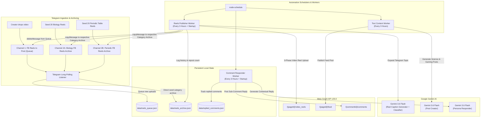
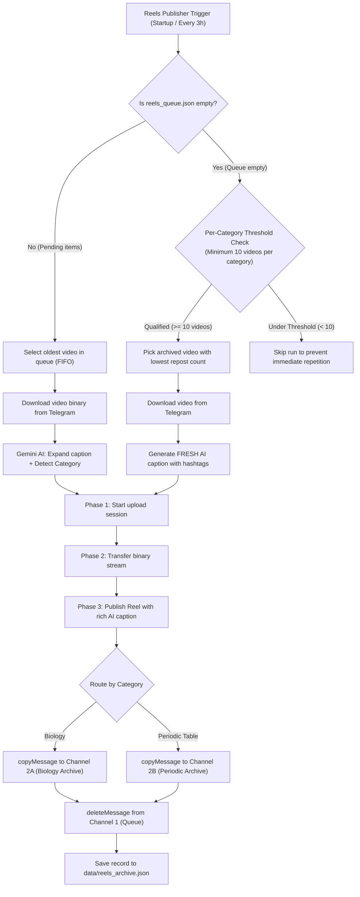

# Facebook & Telegram AI-Driven Automation Engine

A production-grade backend automation engine built with Node.js that powers 24/7 scheduled content creation, multi-channel Telegram video reels publishing, intelligent comment auto-responding, and category-aware evergreen content recycling across multiple Facebook Pages.

---

## 🌟 Managed Facebook Pages & Hubs

* **Nano Facts** — Science, Deep Space & Technology Page
  * Facebook Page: [facebook.com/nanoscie](https://www.facebook.com/nanoscie)
  * Subscription Hub: [facebook.com/nanoscie/subscribe](https://www.facebook.com/nanoscie/subscribe/)
* **Asta Plays** — Mobile Legends: Bang Bang (MLBB) Gaming Page
  * Facebook Page: [facebook.com/astaplasys05](https://www.facebook.com/astaplasys05)

---

## 🚀 Core Systems & Architecture



---

## 🛠️ Workflows & Features

### 1. Multi-Channel Reels Publisher & Category Router

The Reels automation system handles end-to-end video lifecycle management between Telegram and Facebook Reels:



#### Key Reels Features:
* **Direct Archive Preloading / Seeding:** Uploading videos directly to **Channel 2A (`Biology FB Reels Archive`)** or **Channel 2B (`Periodic FB Reels Archive`)** automatically registers their `file_id` into `data/reels_archive.json` with the appropriate category tag.
* **AI Caption Expansion:** Short raw titles or topics provided in Telegram are expanded by Gemini AI into full viral captions featuring:
  * 🏷️ **Unicode Bold Title** (`stringToUnicodeBold`)
  * ❓ **"Did you know..."** hook sentence
  * 🔬 **2-sentence captivating explanation**
  * 🔓 **Subscriber CTA:** `👉 https://www.facebook.com/nanoscie/subscribe/`
  * 👇 **Engagement Question:** *"Comment below: What science topic should be included in our next exclusive study guide?"*
  * 🏷️ **10–15 SEO Keywords** & **5 niche hashtags** (`#Science #Technology #NanoFacts #STEM #{Topic}`)
* **Strict Per-Category 10-Video Threshold:** Evergreen fallback recycling requires at least **10 videos in that category's archive** before recycling activates, preventing repetitive posts.
* **Least-Reposted Priority:** Recycled reels prioritize clips with the lowest `repostCount`.
* **Live Archive Statistics:** Prints live breakdown of evergreen reels per category on every run.

---

### 2. AI Science & Gaming Post Generator

* **Nano Facts (Science & Tech):** Generates rich, educational science posts across diverse fields (Astronomy, Astrophysics, Quantum Physics, Microbiology, Nanotechnology, AI, and Chemistry) with formatted Unicode bold titles and an embedded Subscription Call-to-Action.
* **Asta Plays (MLBB Gaming):** Generates Mobile Legends: Bang Bang hero breakdowns, skill combos, emblem setups, and macro-strategy tips.
* **Unicode Bold Engine:** Automatically transforms standard markdown bolding (`**text**`, `__text__`) and headline keywords into native Unicode bold characters (`𝗔-𝗭`, `𝗮-𝘇`, `𝟬-𝟵`) for native rendering on Facebook feeds.

---

### 3. AI Comment Auto-Responder

* Periodically queries the 10 most recent posts and video reels for both managed pages every 3 hours.
* **Concurrent Execution:** Uses `Promise.allSettled` so both pages run in parallel.
* **Smart Filtering:** Skips comments older than 24 hours, comments from the page itself, and comments already answered.
* **Anti-Spam Human Pacing:** Implements a randomized delay of **45 to 90 seconds** between individual replies to simulate natural human engagement.
* **Deduplication:** Tracks all replied comment IDs in `data/replied_comments.json`.

---

### 4. Facebook Messenger AI Chat Auto-Responder (Webhook Server)

* Built with Express.js supporting `GET/POST /webhook` and `/webhooks` endpoints.
* Validates Meta webhook challenge tokens (`hub.challenge`).
* Dispatches `typing_on` indicators while Gemini generates contextual replies.
* In-memory deduplication ensures webhook retries never send double responses.
* *(Note: Can be enabled via `startServer()` in `src/index.js` when Meta App Review is complete).*

---

## ⏰ 24-Hour Schedule Matrix

The posting timetable is structured so Reels and Text Posts alternate every hour:

| Time | Facebook Reels (`NanoFactsPublisherBot`) | Nano Facts (Science Post) | Asta Plays (MLBB Post) |
| :---: | :---: | :---: | :---: |
| **12:00 AM** | 🎬 Publish / Recycle Reel | — | — |
| **1:00 AM** | — | 🔬 Publish Post | 🎮 Publish Post |
| **3:00 AM** | 🎬 Publish / Recycle Reel | — | — |
| **4:00 AM** | — | 🔬 Publish Post | 🎮 Publish Post |
| **6:00 AM** | 🎬 Publish / Recycle Reel | — | — |
| **7:00 AM** | — | 🔬 Publish Post | 🎮 Publish Post |
| **9:00 AM** | 🎬 Publish / Recycle Reel | — | — |
| **10:00 AM** | — | 🔬 Publish Post | 🎮 Publish Post |
| **12:00 PM** | 🎬 Publish / Recycle Reel | — | — |
| **1:00 PM** | — | 🔬 Publish Post | 🎮 Publish Post |
| **3:00 PM** | 🎬 Publish / Recycle Reel | — | — |
| **4:00 PM** | — | 🔬 Publish Post | 🎮 Publish Post |
| **6:00 PM** | 🎬 Publish / Recycle Reel | — | — |
| **7:00 PM** | — | 🔬 Publish Post | 🎮 Publish Post |
| **9:00 PM** | 🎬 Publish / Recycle Reel | — | — |
| **10:00 PM** | — | 🔬 Publish Post | 🎮 Publish Post |

*Note: The AI Comment Responder runs in parallel every 3 hours (`0 */3 * * *`), and the Reels Publisher also runs 5 seconds after server startup to process any pending items immediately.*

---

## 📁 Directory Structure

```text
├── data/
│   ├── reels_queue.json              # Pending Telegram videos in queue
│   ├── reels_archive.json            # Categorized historical reels & repost counts
│   └── replied_comments.json         # Processed Facebook comment IDs
├── src/
│   ├── config/
│   │   └── env.js                    # Centralized environment variable loader
│   ├── jobs/
│   │   ├── astaPlays.job.js          # Asta Plays content generation & posting
│   │   ├── commentResponder.job.js   # Concurrent comment responder job
│   │   ├── nanoFacts.job.js          # Nano Facts content generation & posting
│   │   └── reelsPublisher.job.js     # Reels FIFO queue worker & Evergreen recycling
│   ├── services/
│   │   ├── ai.service.js             # Google Gemini AI generation & category classifier
│   │   ├── facebook.service.js       # Meta Graph API (Feed, Videos, Reels 3-phase, Comments)
│   │   ├── messenger.service.js      # Messenger Send API & typing indicators
│   │   └── telegram.service.js       # Telegram Bot polling, downloading & archiving
│   ├── utils/
│   │   ├── formatters.js             # Unicode bold text transformer
│   │   └── storage.js                # JSON persistence utility functions
│   ├── server.js                     # Express Webhook server for Messenger
│   └── index.js                      # Application bootstrapper & Cron schedulers
├── .env.example                      # Environment variables reference template
├── package.json                      # NPM package configuration
└── README.md                         # Full project documentation
```

---

## 🔑 Environment Variables Reference

Copy `.env.example` to `.env`:

```bash
cp .env.example .env
```

| Variable | Description | Example / Format |
| :--- | :--- | :--- |
| `OPENAI_API_KEY_ASTA_PLAYS` | Google Gemini API Key for Asta Plays | `AQ.Ab8...` |
| `OPENAI_API_KEY_NANO_FACTS` | Google Gemini API Key for Nano Facts | `AQ.Ab8...` |
| `FB_PAGE_ID_ASTA_PLAYS` | Facebook Page ID for Asta Plays | `349401474923050` |
| `FB_PAGE_ACCESS_TOKEN_ASTA_PLAYS` | Permanent Page Access Token for Asta Plays | `EAAJ...` |
| `FB_PAGE_ID_NANO_FACTS` | Facebook Page ID for Nano Facts | `100120852969913` |
| `FB_PAGE_ACCESS_TOKEN_NANO_FACTS` | Permanent Page Access Token for Nano Facts | `EAAX...` |
| `TELEGRAM_BOT_TOKEN` | Bot API Token from `@BotFather` | `8955836998:AAFSw...` |
| `TELEGRAM_CHANNEL_QUEUE_ID` | Telegram Channel 1 ID (`FB Reels to Post`) | `-1004313359371` |
| `TELEGRAM_CHANNEL_ARCHIVE_BIOLOGY_ID` | Telegram Channel 2A ID (`Biology FB Reels Archive`) | `-1004367909880` |
| `TELEGRAM_CHANNEL_ARCHIVE_PERIODIC_ID` | Telegram Channel 2B ID (`Periodic FB Reels Archive`) | `-1003923070606` |
| `PORT` | Webhook HTTP Server Port | `8080` (Railway standard) |
| `FB_VERIFY_TOKEN` | Webhook Secret Verification Token | `09666712004` |

---

## 🚀 Deployment & Local Execution

### Prerequisites
* **Node.js**: v18.0.0 or higher
* **NPM**: v9.0.0 or higher

### Local Run
```bash
# 1. Install dependencies
npm install

# 2. Start the automation engine
npm start
```

### Production Deployment (Railway / Cloud)
* **Start Command**: `npm start`
* **Target Port**: `8080`
* Ensure all environment variables from the table above are added in the deployment platform's **Variables** settings.

---

## 📜 Meta Graph API Permissions Checklist

Ensure your Facebook Page Access Token includes these permissions:
* `pages_show_list` — Detects and connects to managed pages.
* `pages_read_engagement` — Reads page feed posts, video reels, and comments.
* `pages_manage_posts` — Publishes feed posts, photos, and video reels.
* `pages_manage_engagement` — Posts AI-generated comment replies.

---

## 📄 License

This project is licensed under the [MIT License](LICENSE).
